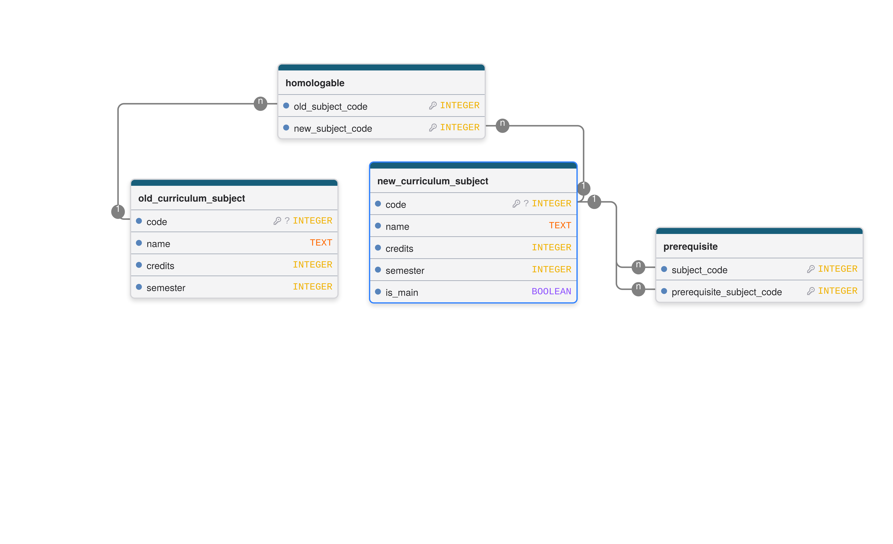
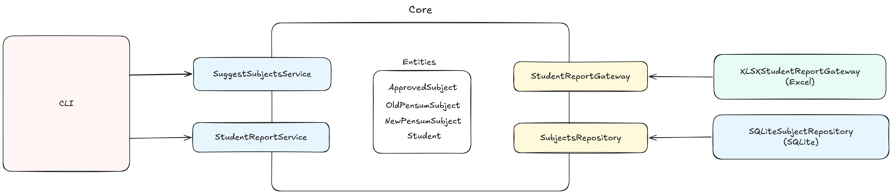

Python CLI application for generation of reports based on student(s) grades historic in PDF, currently generates reports for:

- Homologation of subjects for a new pensum in XLSX format
- Pending subjects in the career in TXT format

The old and new pensum subjects information is allocated in a file-based SQLite database `transition_plan.db` with the following structure:

# Student grades historic

From the PDF file are extracted the following data:

- Name
- Identification
- Subject codes with his respective grade

# XLSX Homologation report

The homologation format is filled with the following data:

- Name
- Identification
- Total number of credits approved
- Subjects relation from the old pensum to the new one

# Architecture

